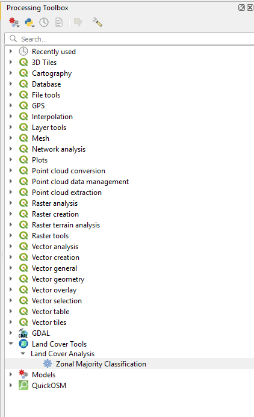
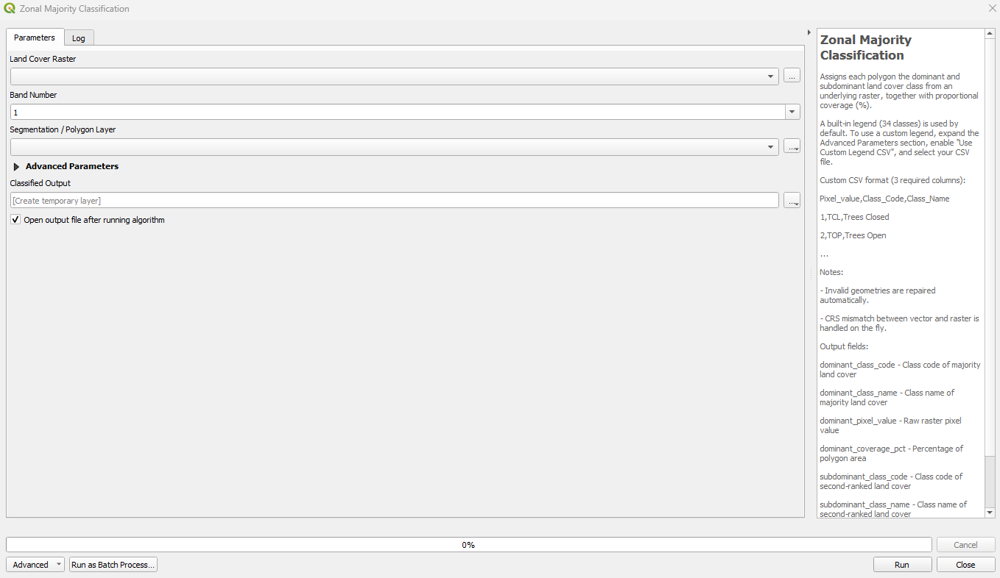
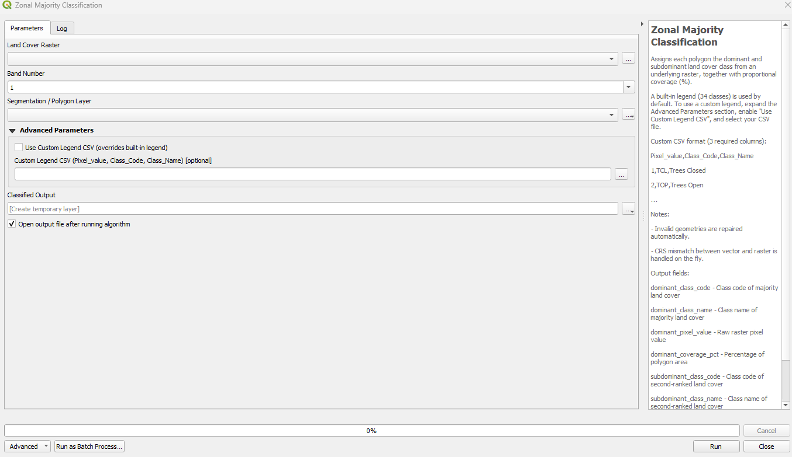

# Landcover Encoding Plugin

A QGIS Processing plugin that assigns dominant and subdominant land cover class labels to polygons from an underlying raster. Built for segmented polygon workflows — each polygon gets the majority and second-majority land cover class extracted from the raster pixels it covers, along with their proportional coverage percentages.

Originally developed for Somalia land cover mapping with a built-in 34-class legend. Supports any land cover raster via a custom legend CSV.

---

## Features

- Assigns **dominant** and **subdominant** land cover class to each polygon
- Reports **coverage percentage** for both classes
- Built-in **34-class Somalia land cover legend** — works out of the box
- **Custom legend CSV** support to override the built-in legend for any region
- Automatic **invalid geometry repair** before processing
- On-the-fly **CRS reprojection** when vector and raster CRS differ
- **Band selection** for multi-band rasters
- Full integration with the QGIS **Processing Toolbox** and **Batch Processing**

---

## Screenshots

### Plugin in the Processing Toolbox
The plugin appears under **Land Cover Tools → Land Cover Analysis → Zonal Majority Classification**.



---

### Plugin Interface — Main Parameters
The main dialog exposes the three required inputs and the output layer.



---

### Plugin Interface — Advanced Parameters Expanded
Expand **Advanced Parameters** to enable a custom legend CSV, overriding the built-in 34-class legend.



---

## Requirements

| Requirement | Version |
|---|---|
| QGIS | ≥ 3.22 |
| Python | 3.x (bundled with QGIS) |
| GDAL/OGR | Bundled with QGIS |
| NumPy | Bundled with QGIS |

No additional Python packages need to be installed.

---

## Installation

### Option 1 — Install from ZIP (recommended)

1. Download the latest release ZIP from the [Releases](https://github.com/Santhosh-M31/landcover-encoding-plugin/releases) page.
2. Open QGIS → **Plugins** menu → **Manage and Install Plugins…**
3. Click **Install from ZIP**, browse to the downloaded ZIP, and click **Install Plugin**.
4. The plugin will appear in the **Processing Toolbox** under **Land Cover Tools**.

### Option 2 — Manual install

1. Clone or download this repository.
2. Copy the `landcover_encoding_plugin` folder into your QGIS plugins directory:
   - **Windows:** `C:\Users\<username>\AppData\Roaming\QGIS\QGIS3\profiles\default\python\plugins\`
   - **Linux/macOS:** `~/.local/share/QGIS/QGIS3/profiles/default/python/plugins/`
3. Restart QGIS.
4. Go to **Plugins → Manage and Install Plugins…**, find **Landcover Encoding Plugin**, and enable it.
5. The tool will appear in the **Processing Toolbox** under **Land Cover Tools**.

---

## Usage

### Step 1 — Open the tool
In the **Processing Toolbox**, navigate to:
```
Land Cover Tools → Land Cover Analysis → Zonal Majority Classification
```
Double-click to open the dialog.

### Step 2 — Set main parameters

| Parameter | Description |
|---|---|
| **Land Cover Raster** | The classified raster layer (e.g. a land cover map with integer pixel values) |
| **Band Number** | The raster band to use (default: 1) |
| **Segmentation / Polygon Layer** | The polygon vector layer whose features will be classified |
| **Classified Output** | Output layer — save to file or create a temporary layer |

### Step 3 — (Optional) Use a custom legend

1. Expand the **Advanced Parameters** section.
2. Check **Use Custom Legend CSV (overrides built-in legend)**.
3. Browse to your CSV file.

Your CSV must have these three columns (with a header row):

```csv
Pixel_value,Class_Code,Class_Name
1,TCL,Trees Closed
2,TOP,Trees Open
3,TVO,Trees Very Open
...
```

### Step 4 — Run
Click **Run**. Progress is shown in the progress bar. The output layer opens automatically when complete.

---

## Output Fields

The output layer contains all original fields from the input polygon layer, plus these 8 new fields:

| Field | Type | Description |
|---|---|---|
| `dominant_class_code` | String | Class code of the majority land cover (e.g. `BSO`) |
| `dominant_class_name` | String | Class name of the majority land cover (e.g. `Bare Soil`) |
| `dominant_pixel_value` | Integer | Raw raster pixel value of the dominant class |
| `dominant_coverage_pct` | Double | Percentage of polygon pixels covered by dominant class |
| `subdominant_class_code` | String | Class code of the second-ranked land cover |
| `subdominant_class_name` | String | Class name of the second-ranked land cover |
| `subdominant_pixel_value` | Integer | Raw raster pixel value of the subdominant class |
| `subdominant_coverage_pct` | Double | Percentage of polygon pixels covered by subdominant class |

> Polygons with no valid raster pixels (outside raster extent, all nodata, empty geometry) will have `NULL` for all 8 fields.

---

## Built-in Land Cover Legend (34 Classes)

The following legend is used by default. It covers the Somalia land cover classification scheme.

| Pixel Value | Class Code | Class Name |
|---|---|---|
| 1 | TCL | Trees Closed |
| 2 | TOP | Trees Open |
| 3 | TVO | Trees Very Open |
| 4 | TBU | Tiger Bush |
| 5 | SCL | Shrubs Closed |
| 6 | SOP | Shrubs Open |
| 7 | SSP | Shrubs Sparse |
| 8 | TSS | Trees and Shrubs Savanna |
| 9 | HGV | Grassland |
| 10 | HFL | Herbaceous Permanent |
| 11 | RGF | Riverine Gallery Forest |
| 12 | TSF | Trees Seasonally Flooded |
| 13 | WVW-ER | Vegetated Wadi |
| 14 | WMA | Woody Mangrove |
| 15 | OPA | Cultivated - Palms |
| 16 | OCR | Cultivated - Generic Orchards |
| 17 | HPF | Cultivated - Herbaceous Perennial |
| 18 | HCR | Cultivated - Herbaceous Rainfed |
| 19 | HCI | Cultivated - Herbaceous Irrigated |
| 20 | BUU | Urban Areas |
| 21 | BUR | Rural Villages |
| 22 | BUA | Airport |
| 23 | BBM | Bomas |
| 24 | BSO | Bare Soil |
| 25 | BRO | Bare Rock |
| 26 | BDL | Badlands |
| 27 | BSD | Sand Dunes |
| 28 | BLS | Loose and Shifting Sand |
| 29 | WWP | Permanent Water Body |
| 30 | WWT | Temporal Water Body |
| 31 | WRI | River |
| 32 | WWC | Water Catchments |
| 33 | WBW-ER | Bare Wadi / Ephemeral |
| 34 | XXX | Water Coastal |

To use a different classification scheme, provide a custom legend CSV as described above.

---

## Notes

- **Geometry repair** is run automatically before processing using QGIS's `native:fixgeometries`. No manual preparation needed.
- **CRS mismatch** between the vector and raster layers is handled on the fly — the polygons are reprojected to the raster CRS during processing. The output layer retains the original vector CRS.
- **Nodata pixels** are excluded from the pixel count before computing majority/subdominant classes.
- **Single-class polygons** (only one unique pixel value) will have `NULL` for all subdominant fields.
- The tool supports **batch processing** via the QGIS Processing Toolbox batch interface.

---

## Repository Structure

```
landcover-encoding-plugin/
├── landcover_encoding_plugin/
│   ├── __init__.py        # QGIS plugin entry point
│   ├── plugin.py          # Registers the Processing provider
│   ├── provider.py        # Groups algorithms under "Land Cover Tools"
│   ├── algorithm.py       # Core zonal majority classification logic
│   ├── metadata.txt       # Plugin metadata (name, version, links)
│   └── icon.png           # Plugin icon
└── screen_shots/
    ├── 01_processing_tool_box_showing_plugin.png
    ├── 02_plugin_interface.png
    └── 03_plugin_interface_explanded_advanced_toggle.png
```

---

## Issues & Contributions

Found a bug or have a feature request? Open an issue on the [issue tracker](https://github.com/Santhosh-M31/landcover-encoding-plugin/issues).

---

## Author

**Santhosh M** — [msanthosh1855@outlook.in](mailto:msanthosh1855@outlook.in)

## License

This project is licensed under the GNU General Public License v2 or later — consistent with QGIS plugin standards.
